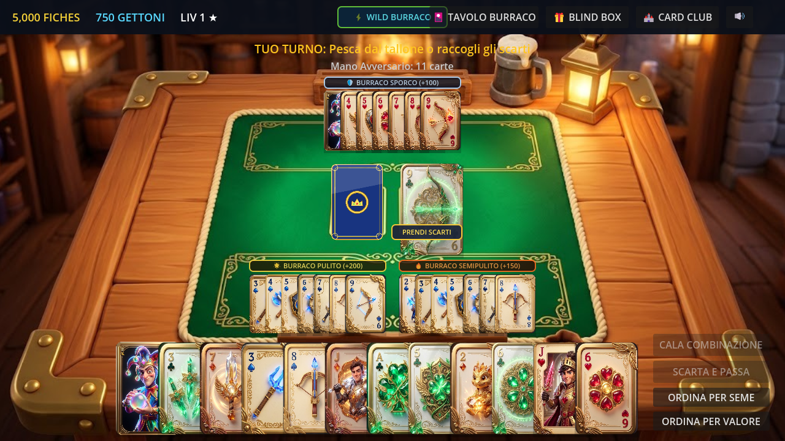

# 🃏 WILD-CARDS: Burraco Digital-Tattile (Mobile Edition) 📱

[-ff7800)](https://godotengine.org)

> **La Rivoluzione Digital-Tattile del Burraco per Smartphone e Tablet.**  
> Fonde il rigore federale del **Burraco Ufficiale F.I.BUR** con l'adrenalina arcade di **Wild Burraco**, carte 3D collezionabili in stile *Pixar + Supercell (Clash Royale)*, audio generativo lofi e fisica elastica ispirata a *Balatro*.

---

## 📸 Schermata di Gioco (Mobile Landscape)

---

## 🌟 Caratteristiche Principali

### 1. 🎴 Deck Completo al 100% (54 / 54 Carte 3D Esclusive)
- **♠️ Picche (Zaffiro / Mecha-Steampunk Arcano):** 13 Carte
- **♥️ Cuori (Rubino Sacro / Paladino & Sovrani del Fuoco):** 13 Carte
- **♦️ Quadri (Topazio Solare / Golem & Cucciolo di Drago):** 13 Carte
- **♣️ Fiori (Smeraldo / Spiriti della Foresta Primordiale):** 13 Carte
- **🃏 Jolly (Neon Chimera / Giullare Cosmico Iridescente):** Monogramma serif dorato JK e finitura prismatica

### 2. 📱 Ottimizzato Specificamente per Mobile (Touch-First)
- **Orientamento:** *Sensor Landscape* con adattamento dinamico a schermi 16:9, 19.5:9, 20:9 e tablet.
- **Interazione Tattile:** Emulazione touch mouse nativa, pulsanti ampi finger-friendly, supporto gesture e tap rapido per calare e attaccare.
- **Motore Leggero:** Rendering gl_compatibility (OpenGL ES 3.0), fluido a 60 FPS stabili anche su dispositivi Android e iOS entry-level.

### 3. ⚔️ Doppia Modalità di Gioco
- **🏆 Burraco Classico F.I.BUR:** Regolamento ufficiale federale puro con calcolo punti nominali, burraco pulito (+200 pt), semipulito (+150 pt), sporco (+100 pt), pozzetto e chiusura (+100 pt). Moltiplicatori di prestigio su Fiches e XP.
- **⚡ Wild Burraco:** Ogni carta sblocca tratti speciali da combattimento (es. *Cavagliere Impavido* ruba fiches, *Occhio Incantatrice* scruta il mazzo, *Scudo del Paladino* congela gli scarti).

### 4. ✨ Effetti Visivi & Particellari AAA
- Burst di scintille stellari (CPUParticles2D) al completamento di un Burraco (Oro brillante, Fiamma viva o Zaffiro).
- Animazione di volo parabolico con rimbalzo elastico all'atterraggio delle carte.
- Sigilli e coccarde dinamiche con pulsazione a respiro.

### 5. 🎁 Blind Box 3D & Collezione
- Spacchettamento animato con forziere 3D che trema e scoppia in coriandoli luminosi.
- Reveal cinematografico delle carte collezionabili con rarità (*Legendary*, *Epic*, *Rare*) e finiture materiche (*24K Gold*, *Neon Amber*, *Chrome*).

### 6. 🎵 Audio & Musica d'Ambiente Procedurale
- Sintetizzatore polifonico in tempo reale che suona una melodia rilassante a tema taverna medievale-fantasy (*Liuto & Arpa Lofi*).
- Sound design tattile per fruscio carte, impatto su feltro, tintinnio fiches e fanfare.
- Tasto Mute (🔊 / 🔇) istantaneo nell'Header.

---

## 🛠️ Come Compilare ed Esportare per Mobile

### Prerequisiti
- **Godot Engine 4.3 Stable** (Standard Version)
- **Per Android:** Android Studio / Android SDK, OpenJDK 17, Debug Keystore
- **Per iOS:** macOS con Xcode e profilo di provisioning Apple Developer

### Esportazione Android (APK / AAB)
1. Apri il progetto in Godot 4.3:
   `ash
   godot --path . -e
   `
2. Vai su **Progetto > Esporta...**
3. Aggiungi il preset **Android**.
4. Seleziona architetture rm64-v8a e rmeabi-v7a.
5. Clicca su **Esporta Progetto** per generare il file .apk o .aab per Google Play Store.

### Esportazione iOS (Xcode Project)
1. In **Progetto > Esporta...**, aggiungi il preset **iOS**.
2. Configura il *Bundle Identifier* (es. com.wildcards.burraco).
3. Esporta il progetto Xcode e aprilo su Mac per la firma e l'installazione su iPhone/iPad.

---

## 📁 Struttura del Progetto

`	ext
wildcards-godot/
├── assets/                  # Texture feltro, forzieri, carte 3D ritagliate
│   ├── cards/              # Tutte le 54 carte PNG ad alta risoluzione
│   └── table_felt_luxury.png
├── scenes/
│   └── main.tscn           # Scena principale (Tavolo, Blind Box, Card Club, UI)
├── scripts/
│   ├── ai_player.gd        # Intelligenza artificiale avversario Burraco
│   ├── asset_loader.gd     # Caching e caricamento asincrono risorse
│   ├── audio_synth.gd      # Sintetizzatore BGM e SFX procedurale
│   ├── blind_box_manager.gd# Spacchettamento forzieri e reveal carte
│   ├── card_data.gd        # Modello dati carte, semi, valori e tratti
│   ├── card_view.gd        # Render tattile della singola carta (Full e Compact)
│   ├── club_manager.gd     # Stanza VIP isometrica e trofei
│   ├── deck.gd             # Gestione dei 2 mazzi (108 carte totali) e pozzetti
│   ├── game_manager.gd     # Core loop di gioco, turni, animazioni e tabellino
│   ├── main_ui.gd          # Gestione tab, audio toggle e comandi
│   ├── particle_effects.gd # Particelle e burst per Burraco e forzieri
│   └── rules.gd            # Regolamento ufficiale F.I.BUR e validazione calate
└── project.godot           # Configurazione motore e parametri Mobile
`

---

## 📜 Regole Federali F.I.BUR Implementate
- **Tris / Scale minime:** Almeno 3 carte per combinazione valida.
- **Matte:** Massimo 1 matta (Jolly o Pinella) per combinazione.
- **Attacco Carte:** Riconoscimento automatico e aggancio di 1 o più carte a calate esistenti.
- **Pozzetto:** Preso al volo (se la mano si azzera calando) o con scarto (al turno successivo).
- **Chiusura Finale:** Necessita di almeno un Burraco (7+ carte) e scarto obbligatorio finale.

---

*Progetto sviluppato con passione per l'eccellenza tattile e mobile gaming.*
